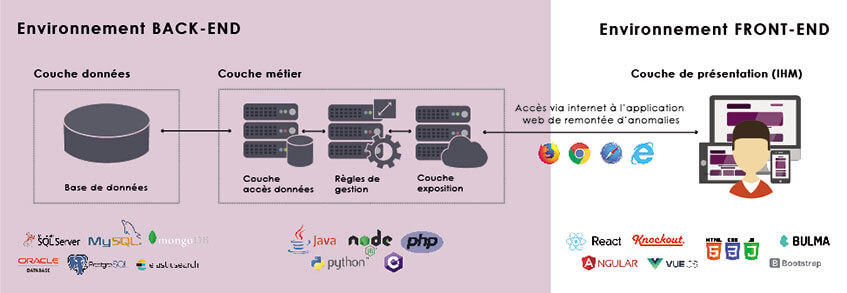
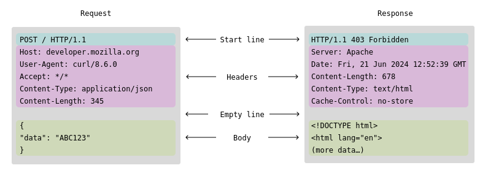
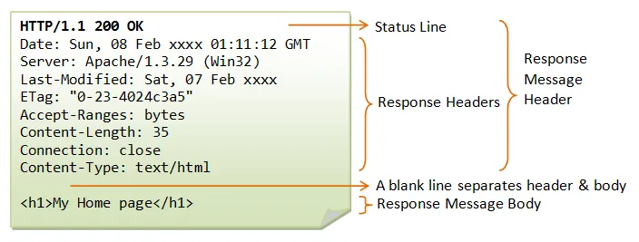

# Webserv Documentation

**Sommaire** :
* [Server HTTP](#quest-ce-quun-serveur-http-)
* [Connexion Clien-Server avec Sockets](#sockets---connection-between-client-server)
* [CGI]()

## Comment fonctionne un site internet ?

Source : [Comprendre la programmation web](https://www.youtube.com/watch?v=eiM3L4mKUqI)



- **Client - Front** : il s'agit de **l'interface directement exploitable par les utilisateurs**, partie émergée de l'iceberg. *IHM* = *Interface Homme Machine*. le code est exécuté par le navigateur de l'utilisateur. Permet une **représentation de notre page internet**. Les données sont mises en forme sous un aspect qui nous permet de les exploiter.

- **Serveur - Back** : la partie traitements, règles métiers et stockage de données, **celle qui régit le fonctionnement de l'application**, la partie immergée de l'iceberg.

- **Navigateurs** : programme qui est capable d'interpréter (*HTML, CSS, Javascript*) et d'afficher une page internet. Interprète des programmes écrits selon les normes *W3C*. Il en existe une grande variété : *Google Chrome, Mozilla Firefox, Microsoft Edge, Safari, Opera*... 
Les navigateurs intègrent également des outils pour aider le développeur dans sa tache : la commande `inspecter` permet entre autre de voir le code source, accéder à la console, voir les erreurs et méthode responsive.

- **HTML (Hypertex Markup Language)** : langage qui va structurer la page web, définit tous les éléments qui vont devoir s'afficher (images, texte, son...), permet de baliser et naviguer entre les pages.

- **CSS (Cascading Style Sheets)** : langage qui permet d'ajouter des éléments de style à la page (couleurs, tailles, alignements, police etc.). Le mot *cascading* vient du fait qu'un élément de style défini pour un élement se répercute sur les éléments qu'il contient. Permet aussi des effets de style comme l'annimation.

- **Javascript** : langage de programmation qui va rendre la page dynamique, grace à des structures de controles (conditions, boucles, fonctions, etc.).

Donc le *HTML*, le *CSS* et le *Javascript* sont considérés comme des langages coté client.
Dans la partie serveur il y a beaucoup plus de liberté du point de vue des langages : *Php, Python, C#, Java, C++, Javascript* (utilisé partie serveur ET client!).
Avec ces langages nous pouvons générer cote serveur des pages interprétables par un navigateur coté client. Par exemple le *Php* va générer du *HTML*.

- **Frameworks** : bibliothèques qui vont faciliter la vie du développeur en leur évitant de réinventer la roue à chaque nouvelle application. Ils fournissent des **outils pour une base commune et servent un grand nombre d'applications différentes**. Ils sont écrits dans différents langage de programmation et peuvent etre coté serveur et coté client.
	- se distinguent des *bibliothèques* par leur aspect non spécialisé : les *frameworks* permettent de créer n'importe quel site web.
	- exemple de **frameworks par langage coté client** : *Javascript* -> *React, Ember.js, svelte, Angular, vue.js*
	- exemple de **frameworks par langage coté serveur** : 
		- *Php* -> *Symfony, Laravel, Zend*
		- *Python* -> *Django, Flask*
		- *C#* -> *ASP, .NET*
		- *Java* -> *J2EE*
		- *Ruby* -> *Ruby on Rails*
		- *Javascript* -> *Node.js, express.js, Meteor*

- **Bibliothèques** : ensemble d'outils, spécifique à une tache. 
	- *JQuerry* : permet de parcourir facilement le *DOM* et contient des fonctionnalités d'animation.
	- *Ajax* : permet de modifier l'affichage d'une page web sans avoir à la recharger.
	- *Bootstrap* : sert à la création de design pour HTML, CSS et avec des extensions JS.

- **Data Base** : à pour fonction de **stocker** des informations. La Data base se trouve du coté serveur, ce qui empeche le client d'avoir accès à toutes les données. Sa gestion se fait à l'aide d'un langage spécifique.
	- *Les bases relationnelles* (intègrent des outils pour s'assurer de la cohérence des données) : *MySQL, SQL Server, Oracle, MariaDb, PostGRESQL*.
	- *Les Bases NoSQL* (plus rapides mais vérifiant moins de choses que les bases SQL) : *MongoDb, Apache Cassandra, Apache Hbase, RavenDB*.

- **ORM (Object-relational mapping)** : composant logiciel qui se glisse entre un programme et une base de données. S'occupe de gérer les problèmes d'interface. Utile aussi pour créer la base de donnée (porte d'entrée vers la data base == interface). Les *ORMs* sont souvent intégrés aux *frameworks* :
	- *Javascript* : *Knex.js, Mongoose*
	- *Php* : *Doctrine, Eloquent*
	- *Python* : *SQLAlchemy, MongoEngine*
	- *Java* : *Hibernate*
	- *C#* : *Dapper*

### Le matériel physique d'Internet

Tout système connecté au reseau Internet est un **hote**. On peut diviser les *hotes* en deux catégories : clients et serveurs.

Le *client* peut etre un ordinateur, smartphone, console de jeu ou tout autre objet connecté.
Le *serveur* est une machine qui stocker et distribue des pages de sites web, diffuse des vidéos en streaming, relaie les emails etc.

Quand un *hote* envoie des données à un autre : il découpe les données et y ajoute quelques octets en tete. Le resultat est une suite de **paquets** qui est expédiée à travers le réseau jusqu'à l'*hote* de destination.

Le destinataire doit ensuite rassembler les *paquets* et reconstituer les données après réception.

Les *hotes* sont liés entre eux à l'aide de différents **supports physiques** sur lesquels peuvent circuler tous les bits d'un *paquet*.

Ces *supports physiques* peuvent etre des lignes coaxiales, des cables de cuivree, fibres optiques ou des ondes radio.

Les *paquets* doivent passer par des **commutateurs réseau** (=**switches**) et des **routeurs**. Ces deux appareils ont pour unique but de recevoir des *paquets* depuis leur ligne d'entrée et de les transférer via leur ligne de sortie la plus appropriée.

Chaque *hote*, *routeur* ou *commutateur* est un **noeud du reseau**. Cette suite de relais par lequel passe un *paquet* pour arriver à sa destination est ce qu'on appelle le **routage**.

Pour mieux comprendre :
* [Routage (adresses IPv4 et submask)](https://www.codequoi.com/adresses-ipv4-routage-et-masques-de-sous-reseau/)


# Qu'est-ce qu'un serveur HTTP ? 

Sources :
* [Glossaire MDN : définitions des termes du Web](https://developer.mozilla.org/fr/docs/Web/HTTP)
* [Documentation pour Webserv](https://hackmd.io/@fttranscendance/H1mLWxbr_)
* [Comprendre l'architecture en couches](https://www.codequoi.com/adresses-ipv4-routage-et-masques-de-sous-reseau/)

### HTTP (Hypertex Transfert Protocol)
Est un protocole de communication informatique basé sur le modèle client-serveur.

Ce protocole est le fondement du *World Wide Web*, il permet de ***transporter toutes sortes de données*** (des pages web, fichiers, streaming).

Il permet une communication externe (Internet) ou interne (intranet) entre plusieurs ordinateurs.

**Serveur HTTP** : un serveur informatique répondant à des requetes sous la forme de relation client-serveur. Il peut prendre la forme d'un ordinateur contenant ***un logiciel qui va répondre à des requetes de protocole HTTP***.

Il est pensé pour etre disponible en permanence à recevoir et répondre à des requetes simultanément venant des clients.

**HTTPS != HTTP** -> HTTPS a une nouvelle surcouche sécurisée, qui permet de chiffrer les communications entre le client et le serveur pour protéger contre l'analyse des communications (avec des données sensibles : mot de passe, codes bancaires).

***Apache*** et ***Nginx*** sont les deux logiciels les plus utilisés en tant que serveur *HTTP*. Mais il est préférable de se baser sur le comportement (configuration, syntaxe et mot-clés) de *Nginx*.

### Anatomie d'une requete HTTP

Source : 
* [Protocole HTTP](https://developer.mozilla.org/en-US/docs/Web/HTTP)
* [Article explicatif](https://ege-hurturk.medium.com/creating-your-own-http-server-part-i-c1d567735af2)



Une requete HTTP est un message suivant un certain format :

- 1. **Request line** = *method + target request + protocol + CRLF*
	- `<method>` : Indique le but de la requete. Par exemple `GET` signifie que le client attend une ressource en retour. `POST` indique que le client envoie des donnée au serveur. [(Liste complète des méthodes ici)](https://developer.mozilla.org/en-US/docs/Web/HTTP/Reference/Methods).
	- `<request-target>` : Attend `URI`, une chaine qui fait référence à une ressource, peut etre une **URL**, chemin de  la ressource sur le serveur, exemple : */index.html*, un seul slash "/" designe *index*.
	- `<protocol>` : Attend la version de *HTTP* voulue.

- 2. **Header** = Zéro, un ou plusieurs messages indicatifs sur la requete + CRLF

- 3. CRLF (empty line)

- 4. **Optional message body** = Contient des données associées avec la requete, dans le cas d'un `POST` par exemple on signifie ce que l'on souhaite transmettre au serveur comme data.

CRLF = saut de ligne comme ca `\r\n`.

### Anatomie d'une réponse HTTP



Après avoir recu une requete HTTP, le serveur écrit et envoie une réponse :

- **Status line** =  `<HTTP version>` + `<status code>` + `<status message>`
	- [status message & code HTTP list](https://developer.mozilla.org/en-US/docs/Web/HTTP/Reference/Status)
- Headers + CRLF
- CRLF
- Message body

### Etapes du processus HTTP

***The client enters the *URL* and the *browser* constructs an HTTP request.***

Lorsqu'un client souhaite communiquer avec le serveur, voici les différentes étapes :
-	1. **Opening a TCP connection:** la connection doit etre établie pour transmettre/recevoir les requetes/réponses depuis le serveur. 
-	2. **Send an HTTP request:** Le client envoie une requete HTTP à travers la connexion *TCP* suivant le bon format de requete.
-	3. **Receive an HTTP response:** Le serveur interprete la requete HTTP et prepare une reponse, puis l'envoie selon le bon format.
-	4. **Close the TCP connection:**

# Sockets - connection between Client-Server

- Source :
* [Programmation réseau via socket](https://www.codequoi.com/programmation-reseau-via-socket-en-c/)
* [Video Sockets d'1h](https://www.youtube.com/watch?v=oYBgV474Udc)
* [Socket Programming GeeksForGeeks](https://www.geeksforgeeks.org/socket-programming-cc/)
* [Inner workings of the Webserver](https://hackmd.io/@laian/SJZHcOsmT#Sockets-and-Useful-Network-Functions)
* [Handling sockets with C++](https://ncona.com/2019/04/building-a-simple-server-with-cpp/)
* [Video d'1h - Network Programming - C++ Sockets](https://www.youtube.com/watch?v=gntyAFoZp-E)

The connection between clients and servers are facilitated by sockets, which are the *communication link between two processes on a network*.

A ***socket is a file descriptor created using this function*** :

```cpp
int	socket(int, domain, int type, int protocol);
```
- `domain` = refers to the communication domain. [Domain list here](https://linux.die.net/man/2/socket)
- `type` = type of socket.
- `protocol` = refers to a particular protocol to be used with sockets, usually is **0**.

#### Types of sockets

- **Stream Sockets** -> `SOCK_STREAM`
-> are reliable two-way connected communication streams which uses TCP. These sockets are usually used by HTTP when speed is not the priority, but data quality is.

- **Datagram Sockets** -> `SOCK_DGRAM`
-> are connectionless sockets that use the UDP (User Datagram Protocol). So when data is sent, it may not arrive. These sockets are commonly used by games/video/audio where speed is priority.

Once we have a socket descriptor, we need to ***bind it to a port on the computer*** with:
```cpp
int	bind(int sockfd, const struct sockaddr *addr, socklen_t addrlen);
```

#

### Web Request flow
Source : [video here](https://www.youtube.com/watch?v=hWyBeEF3CqQ)

- 1. entering the URL
	- User is entering the URL in the browser
	- Browser quickly parse the URL
- 2. DNS Resolution
	- returns the IP address of the domain
- 3. Establishing the Connection
	- with an IP address, the browser can now connect to a Web Server
	- the connection is made with TCP (Transmission Control Protocol) or UDP (User Datagram Protocol)
	- The client sends a SYN (Synchronize packet) packet to the server to request a connection.
	- The server answers with a SYN/ACK (Sync Acknowledge Packet).
	- At this point TCP connection is done.
- 4. Sending th HTTP Request
	- send a GET request to fetch HTML Document from server, according to the HTTP request
	- HTTP request contains many important data in headers like the user-agent, describes which browser is being used. Or can contains Cookies, website data stored on our local machine.
	- caching is re-susing data that was previously dowloaded
- 5. The server recieves the request
	- the server uses its data base, call API or uses scripts to customize a response to the request.
- 6. Backend Processing (optional)
- 7. Generating the response
	- Prepares a HTTP response (status code, mesasge, headers with content, the body contains the html page)
- 8. Sending the HTTP Response
	- Responses goes through routers to the machine
- 9. Receiving the response
	- Load the web page nad all the data associated (content, cookies, policies...) because the data arrives in packets... and the browser renders  the page and displays it
- 10. HTML Parsing
	- DOM = document object model.
- 11. and so on with the engine details

### Ressources en brol
* [https://www.youtube.com/watch?v=9J1nJOivdyw](https://www.youtube.com/watch?v=9J1nJOivdyw)
* [https://hackmd.io/@laian/SJZHcOsmT](https://hackmd.io/@laian/SJZHcOsmT)
* [https://www.youtube.com/watch?v=YwHErWJIh6Y](https://www.youtube.com/watch?v=YwHErWJIh6Y)
* [https://www.youtube.com/watch?v=gntyAFoZp-E](https://www.youtube.com/watch?v=gntyAFoZp-E)
* [https://m4nnb3ll.medium.com/webserv-building-a-non-blocking-web-server-in-c-98-a-42-project-04c7365e4ec7](https://m4nnb3ll.medium.com/webserv-building-a-non-blocking-web-server-in-c-98-a-42-project-04c7365e4ec7)
* [https://developer.mozilla.org/fr/docs/Web/HTTP](https://developer.mozilla.org/fr/docs/Web/HTTP)
* [https://fr.wikipedia.org/wiki/Hypertext_Transfer_Protocol](https://fr.wikipedia.org/wiki/Hypertext_Transfer_Protocol)
* [https://www.tutorialspoint.com/cplusplus/cpp_web_programming.htm](https://www.tutorialspoint.com/cplusplus/cpp_web_programming.htm)
* [https://ncona.com/2019/04/building-a-simple-server-with-cpp/](https://ncona.com/2019/04/building-a-simple-server-with-cpp/)
* [https://medium.com/from-the-scratch/http-server-what-do-you-need-to-know-to-build-a-simple-http-server-from-scratch-d1ef8945e4fa](https://medium.com/from-the-scratch/http-server-what-do-you-need-to-know-to-build-a-simple-http-server-from-scratch-d1ef8945e4fa)
* [https://www.geeksforgeeks.org/socket-programming-cc/](https://www.geeksforgeeks.org/socket-programming-cc/)
* [https://ege-hurturk.medium.com/creating-your-own-http-server-part-i-c1d567735af2](https://ege-hurturk.medium.com/creating-your-own-http-server-part-i-c1d567735af2)
* [https://www.youtube.com/watch?v=hWyBeEF3CqQ](https://www.youtube.com/watch?v=hWyBeEF3CqQ)