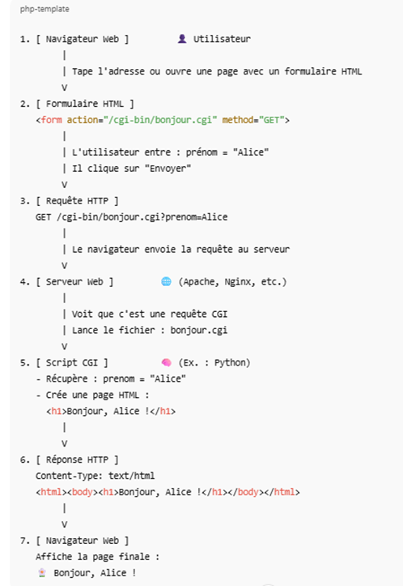

# CGI (Common Gateway Interface)

## Qu'est-ce que le CGI ?

c'est une interface standardisée qui permet aux serveurs web d'exécuter des programmes externes (script PHP, Python, binaires, ...) pour traiter les requetes HTTP des utilisateurs cote client. Contrairement aux fichiers statiques (HTML, images, ...), un CGI genere dynamiquement une reponse. Le serveur transmet certaines informations a l'environnement du script via des variables d'environnement, puis lit la sortie standard du script comme reponse HTTP.

Le *CGI* permet donc un échange de données entre des applications externes et les sevreurs web.

#### <ins>Que se passe-t-il ?</ins>
- Le client (un navigateur web) envoie une requête au serveur pour un document. Si possible, le serveur répond directement à la requête en envoyant le document.
- Si le serveur détermine que la requête ne concerne pas un document qu’il peut simplement livrer, il crée alors un processus CGI. 
- Le processus CGI transforme les informations de la requête en variables d’environnement. Ensuite, il établit un répertoire de travail courant pour le processus enfant. Enfin, il établit des canaux de communication (pipes) entre le serveur et un programme CGI externe.
- Une fois que le programme CGI externe a traité la requête, il utilise le canal de communication pour renvoyer une réponse au serveur, qui à son tour envoie la réponse au client.

#### <ins>Schéma : Parcours Client → Serveur → CGI → Réponse</ins>



## Etapes pour intégrer un CGI :
#### <ins>1. Detecter les requêtes qui doivent être traitées par un CGI :</ins>
Lorsqu’on parse la requête, la condition est d’avoir un chemin avec un fichier ayant une extension CGI mapee dans la config
#### <ins>2. Preparer les variables d’environnement du CGI :</ins>
Ex : CONTENT_LENGTH=123
REQUEST_METHOD=POST
SCRIPT_NAME=/cgi-bin/script.py
PATH_INFO=/cgi-bin/script.py
QUERY_STRING=foo=bar
CONTENT_TYPE=application/x-www-form-urlencoded
les construire dans une function dédiée, sous la forme d’un tableau de char*(char *envp[]) pour execve. 
#### <ins>3. Créer un pipe pour la communication entre serveur et CGI :</ins>
Le CGI doit pouvoir lire la requête POST (via stdin du CGI) et écrire la reponse (via stdout du CGI) ; donc pipe() pour stdout (lecture du resultat du CGI et de manière optionnelle pipe() pour stdin si on doit envoyer un body (ex : POST)
#### <ins>4.Forker pour exécuter le CGI</ins>
#### <ins>5. Integrer la sortie du CGI dans la réponse http :</ins>
Le CGI va écrire des headers http puis le corps . On doit lire sa sortie, ne pas rajouter nos propres headers sauf si le CGI en a oublie et l’envoyer tel quel au client.

## Avec mes fonctions ca donne :
#### <ins>1. Le client envoie une requete HTTP :</ins>
Exemple:
```
GET /cgi-bin/test.php?data=Bonjour HTTP/1.1
```
#### <ins>2. Le serveur :</ins>
- Parse la requête
- Identifie que la ressource est un script CGI (`isCgi()`),
- Vérifie que le fichier existe et est lisible (`isValid()`),
- Vérifie la validité de la query string (`isQueryStringValid()`),
- Construit les variables d’environnement (`buildCgiEnv()`),
- Lance le script avec execve() et communique via pipes (stdin/stdout).

#### <ins>3. Le script : </ins>
S'execute et renvoie une sortie HTTP-like.
#### <ins>4. Le serveur :</ins>
Capture cette sortie et construit une reponse HTTP complete via `buildHttpResponseFromCgiOutput()`


#### <ins>Codes erreurs utiles : </ins>

| Code | Signification                | Quand l’utiliser dans ton projet                                          |
|------|-------------------------------|--------------------------------------------------------------------------|
| 200  | OK                           | Tout s’est bien passé                                                     |
| 301/302 | Redirection               | (Bonus) Si tu veux rediriger une URL                                      |
| 400  | Bad Request                  | Requête mal formée (mauvaise syntaxe HTTP...)                             |
| 403  | Forbidden                    | Le fichier existe mais pas le droit (ex: pas exécutable / pas lisible)    |
| 404  | Not Found                    | Le fichier/script n’existe pas                                            |
| 405  | Method Not Allowed           | La méthode (POST/GET/DELETE) n’est pas autorisée pour cette route         |
| 413  | Payload Too Large            | Le body dépasse `client_max_body_size` dans la config                     |
| 414  | URI Too Long                 | `_URI > 2048`              												  |
| 500  | Internal Server Error        | Erreur côté serveur (fork, pipe, execve, malloc, etc.)                    |
| 502  | Bad Gateway                  | (Bonus) Erreur d’un proxy ou d’un CGI qui renvoie quelque chose d’invalide|
| 505  | HTTP Version Not Supported   | Si on reçoit autre chose que HTTP/1.1                                     |

